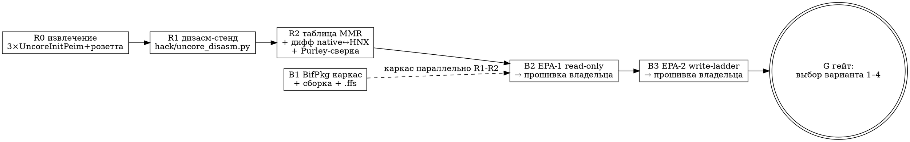

# Бифуркация Port 2 на родном билде — цикл A: разведка (розетта-первый) — дизайн

Дата: 2026-09-14. Статус: на ревью владельца.
Первоисточники: `TODO.md` §450x («следующий цикл — свой бифуркационный
драйвер», решение владельца 2026-09-14), отчёт-сага
`docs/reports/2026-09-14-450x-bifurcation-serial-saga.md` §7,
спека `2026-09-12-formset-unlock-design.md` §6 (карта NVRAM-вопросов).
Согласовано владельцем (live 2026-09-14): структура «сначала
разведка-цикл»; база — **`refs/amibcp/450x — копия.bin`** (восстановлен
из бекапа); цель — **только бифуркация Port 2** (x4x4x4x4, пассивный
рейзер 2×NVMe); серийка вне скоупа (на нативе жива через BMC/SOL).

## 1. Контекст и цель

Родной билд владельца (натив-Lenovo, 450x-семейство) игнорирует ручку
бифуркации из обоих носителей: посев шаблона не применяется (политика
захардкожена), UI-сейв в рантайм-сторе жив, но порт остаётся x16
(вердикты v6, сага §4). HNX и 超微450 билды ручку применяют, но это
чужие миры (HNX — вырезан серийный вывод и чужой ME-регион; 超微450 —
чужой BMC). Владелец решил: свой драйвер на родном билде вместо борьбы
с чужими.

Варианты по возрастанию веса (нумерация TODO): **(1)** DXE-лайт;
**(2)** дизасм-патч нативного UncoreInitPeim; **(3)** кросс-свап
UncoreInitPeim из HNX; **(4)** полный свой PEIM. Выбор варианта —
**данные, а не вкусы**: физика (uncore-MMR, лей-маппинг защёлкивается
на ресете, после тренинга заперто) делает исход решающим на железе.

**Цикл A — разведка**: RE-таблица регистров + EPA-проба записываемости
из DXE + гейт выбора варианта. Продакшн-реализация — цикл B.
**Критерий успеха цикла A**: вариант 1–4 выбран с железным
обоснованием; stretch-цель — при победе варианта 1 бифуркация уже
работает (EPA-2 = его MVP).

## 2. Входы и материал

| Что | Где | Роль |
|---|---|---|
| База-донор | `refs/amibcp/450x — копия.bin` | нативная полиси (захардкожена); сюда инжектится пробник |
| UncoreInitPeim натив | извлечь из базы (канонический GUID `D71C8BA4-4AF2-4D0D-B1BA-F2409F0C20D3`, байтово `a48b1cd7…`; R0 закрыл маппинг: FFS 799090 натив / 606322 HNX / 628434 超微, PE32-тела 798880/606112/628224) | главный предмет дизасма |
| UncoreInitPeim HNX | `refs/fw/HNX99TF_200525_original_E5C88C6F.bin` | **живая полиси**: посев→кремний доказан (v2, v7) — источник known-good значений и дифф-партер |
| Розетта `IIO-pei32.bin` | `refs/fw/IIO-pei32.bin` (798880, PE32; R0: байт-идентична нативному UncoreInitPeim) | строковые якоря «Invalid IOUx Bifurcation» / «busUncore» / «busIio» — локализатор кода бифуркации в нативе (HNX/超微 строк не имеют, R0) |
| Purley-референс | shallow-clone `edk2-platforms` → `refs/edk2-platforms` (новый, паттерн `refs/edk2`: не модифицируется) | карта «что/в каком порядке» (Skylake-SP ≠ Grantley — не бинарно) |
| Haswell-EP Uncore Programming Guide | веб-справка (публичный даташит поколения) | опциональный семантический кросс-чек адресов MMR |
| EDK2-стенд | `docker/edk2-builder.containerfile` + паттерн `UefiPatcherSerialPkg` (цикл Serial S1) | сборка пробника, X64 DXE_DRIVER |
| Движок | `node extract` / `node insert` / `node replace` | без изменений в цикле A |

Карта ручек (форма 118/IIO 0, Port 2): `IntelSetup` varstore
(`EC87D643-EBA4-4BB5-A1E5-3F3E36B20DA9`), офсет `0x531` = полная
бифуркация IOU0, значение 0 = x4x4x4x4 (спека formset-unlock §6).
В цикле A пробник пишет **константы из RE-таблицы**; чтение IntelSetup —
цикл B (продуктовизация варианта 1).

## 3. Ступени цикла A

Владельческих live-гейтов два: прошивки B2 и B3 (бюджет прошивок
цикла A = 2; резервный третий EPA-2b — если RE-таблица R2 потребует
уточнения адресов или warm-ресет не защёлкивает лей-мап и нужен
cold).

## 4. Трек R: RE-разведка

### R0 — извлечение

`node extract` трёх UncoreInitPeim (натив из базы, HNX, и третий из
超微450 как контроль) + фиксация в отчёте: полный GUID, размер, тип
секции (PE32/TE), machine (PEI Grantley = IA32). Розетта уже файл.

### R1 — дизасм-стенд

`hack/uncore_disasm.py` (python + **capstone** в контейнере
edk2-builder; докстановка `pip install capstone` в образ — единственное
изменение образа). Возможности: парс PE/TE-заголовка (image base,
секции), список строк с VA, xref строк → код, поиск MMIO-паттернов
(`mov [mem], reg` на диапазоны BAR/MMCONFIG, PCI-cfg-доступ CF8/CFC,
обёртки MmioWrite), интерактивный дизасм диапазона. Отрабатывает на розетте (строки есть; R0: розетта байт-идентична нативу — калибровка = локализация в нативе); на HNX/超微 строк нет (R0) — перенос по структурной похожести кода вокруг тех же констант/вызовов.

### R2 — таблица MMR + дифф

Дифф native↔HNX UncoreInitPeim — главный инструмент: HNX применяет
ручку, натив игнорит → расходящиеся ветки = полиси-код. Выход —
таблица в отчёте разведки:

| Поле | Смысл |
|---|---|
| `purpose` | что за регистр (напр. «IOU0 Port2 bifurcation control») |
| `access` | как писать: PCI-cfg `bus:dev:fun/off` или MMIO `phys-addr` |
| `width` | 1/4/8 байт |
| `native_value` | что пишет натив (x16) |
| `hnx_value_x4x4x4x4` | что пишет HNX для x4x4x4x4 — **known-good для EPA-2** |
| `sequence` | порядок относительно ресета/тренинга |
| `lock` | лок-регистр и момент лока (если виден в коде) |

Плюс: локализация захардкоженной полиси натива (offset в PEIM — вход
варианта 2), сверка адресов с Purley-картой (порядок/семантика) и
(опционально) UPG-даташитом. Отчёт: `docs/reports/2026-09-14-uncore-bif-recon.md`.

**Если полиси не локализуется** (обфускация/нет строк/нет диффа):
fallback — вариант 3 (кросс-свап) без полного понимания; R2 в этом
случае закрывает только таблицу адресов для EPA по розетте.

## 5. Трек B: EPA-пробник (MVP варианта 1)

### B1 — каркас (параллельно R1–R2)

Пакет `docker/edk2/UefiPatcherBifPkg/` по образцу SerialPkg:

| Файл | Ответственность |
|---|---|
| `UefiPatcherBif.dsc` / `.fdf` | платформа + FV BIF (1 INF) |
| `BifEpaProbe/BifEpaProbe.inf` + `.c` | DXE_DRIVER X64, без DEPEX (готов исполняться рано) |
| `docker/build_bif_epa.sh` | двухрежимный (хост→podman-remote / контейнер), режим пробника `--epa-mode=read\|write` печь PCD-ом |
| `hack/edk2_bif_check.py` | slim-валидатор (FFS-заголовки, PE machine/subsystem, воспроизводимость ×2) по образцу `edk2_build_check.py` |
| `crates/uefi-engine/tests/data/bif/BifEpaProbe.ffs` + `tests/bif_ffs.rs` | коммитимый артефакт + тест движка (парсинг/инварианты) |

Таблица адресов вшивается при сборке из JSON-выгрузки R2
(`docs/reports/2026-09-14-uncore-bif-mmr.json`) — пробник **не имеет** режима
«писать куда-то, чего нет в валидированной таблице» (никакого
runtime-фроззинга).

### Логика пробника

Событие: entry point (ранний DXE). UART пробник инициализирует сам
(паттерн SerialDxe: 8N1 115200, базу — из R0/R2) — печать значений
только через UART. NVRAM-переменная `BifEpaStage` (gRT->SetVariable,
NON_VOLATILE|BOOTSERVICE_ACCESS) — маркер стадии и **one-shot защита от
ресет-лупа**; значений она не хранит. Молчание UART на EPA-1 —
стоп-условие: без телеметрии EPA-2 не прошивается (уточнение базы —
возврат в R2).

**EPA-1 (read-only)**: прочитать MMR-таблицу → печать всех значений +
запись в `BifEpaStage` → возврат. Нулевой риск. Проверяет телеметрию и
снимает фабричные значения (baseline для сверки с HNX-ожиданиями).

**EPA-2 (write-ladder, один бут)**: печать previous → read → печать →
**write** (значения `hnx_value_x4x4x4x4`, порядок `sequence` из
таблицы — ровно как пишет живая полиси на этом же кремнии) → readback →
печать → `BifEpaStage=written` → пауза 3 с (владелец читает SOL) →
`ResetSystem(Warm)` **только если readback совпал**; иначе — отчёт о
расхождении, без ресета. **Следующий бут** (тот же образ): пробник видит
`written`, НЕ пишет, читает MMR → печать «пережил ли ресет» (PEI
перепрограммировал обратно? значение осталось?) → сброс маркера.
Владелец проверяет топологию в ОС (обе NVMe = PASS, как v7).

### B2/B3 — образы

`node insert` артефакта в DXE-FV базы → `refs/amibcp/
450x-kopiya-bif-epa1.bin` / `…-epa2.bin` (образы не коммитятся,
sha256 в отчёте). Прошивка — владелец (TMM; recovery при бут-лупе —
TMM-перепрошивка, отработанная практика v6/v8).

## 6. Гейт G: выбор варианта

| Железный результат EPA-2 (бут N+1) | Диагноз | Вариант для цикла B |
|---|---|---|
| MMR = наши значения **и** Port 2 = 2A/2B в ОС | DXE-программирование достаточно, лей-мап защёлкивается warm-ресетом | **1** — продуктовизация: чтение IntelSetup `0x531+` → MMR → one-shot reset (флаг уже в пробнике) |
| MMR = наши значения, топология x16 | лей-мап требует программирования ДО тренинга (PEI) | **2** — патч нативного PEIM по offset из R2; движку — replace-FFS-in-PEI-FV |
| MMR = перепрограммировано PEI обратно | UncoreInitPeim затирает нас на каждом буте | **2** (или 3, если патч лохмат — HOB-версии проверены R2) |
| Write не прилипает (readback ≠ записанное) | регистры лочатся после PEI | **2/3** — PEI-время обязательно |
| Машина зависает на write | плохой адрес/порядок → таблица R2 неполна | уточнение R2 → резервная 3-я прошивка (EPA-2b) |

Вариант 4 (полный свой PEIM) — только при смерти 1–3 (не ожидается).
Отрицательные исходы = валидный результат гейта: каждый исключает
класс решений и оставляет точный offset из R2.

## 7. Границы скоупа

- **Движок: ноль изменений.** `node extract/insert/replace` покрывают
  цикл A. Capability replace-FFS-in-PEI-FV (+rebuild PEI-тома) — цикл B,
  только для вариантов 2/3.
- Серийная консоль вне скоупа (натив уже имеет BMC/SOL).
- UI/$SPF/HII не трогаем: проблема — политика в железе, не интерфейс.
- `refs/edk2-platforms` — shallow clone, не модифицируется, в сборке
  не участвует (только чтение человеком/скриптом на R2).
- BIOS-образы и извлечённые PEIM не коммитятся (sha256 в отчёте);
  `.ffs`-артефакт BifEpaProbe и hack-скрипты — коммитятся.

## 8. Риски

| Риск | Митигция |
|---|---|
| Дизасм не локализует полиси | дифф native↔HNX (живая vs мёртвая полиси — сильнейший якорь); fallback вариант 3 |
| Ложный адрес в таблице → зависание/кривая запись | значения и порядок = known-good HNX (та же полиси на том же кремнии); only-Port-2 скоуп записи; пауза перед ресетом; TMM-recovery |
| UART-телеметрия молчит | EPA-1 специально проверяет телеметрию до любого write; молчание = стоп-условие (уточнение базы UART в R2, повтор EPA-1) |
| Ресет-луп после EPA-2 | one-shot маркер `BifEpaStage`; CMOS-снос безопасен (маркер исчез → повтор write+reset → сходится) |
| Warm reset не защёлкивает лей-мап | EPA-2b: пересборка с PCD reset=Cold — расход резервной прошивки №3 (тот же резерв, что и на уточнение адресов) |
| edk2-platforms Purley-код бесполезен (закрытые BinPkg) | он опционален: первоисточник — дизасм; Purley = карта порядка, UPG = семантика |

## 9. Артефакты цикла A

1. `hack/uncore_disasm.py` — RE-стенд (коммит).
2. `docs/reports/2026-09-14-uncore-bif-recon.md` — RE-таблица MMR,
   дифф-вердикт, дампы EPA-1/EPA-2, вердикт гейта G (коммит).
3. `docker/edk2/UefiPatcherBifPkg/` + `docker/build_bif_epa.sh` +
   `hack/edk2_bif_check.py` (коммит).
4. `crates/uefi-engine/tests/data/bif/BifEpaProbe.ffs` + тест
   `bif_ffs.rs` (коммит).
5. `refs/amibcp/450x-kopiya-bif-epa{1,2}.bin` — локально, sha256 в
   отчёте.
6. Вход цикла B: выбранный вариант + (для 2) точный offset патча,
   (для 1) готовый MVP.

## 10. Открытые данные, закрываемые треками

| Вопрос | Кто закрывает |
|---|---|
| Полный GUID UncoreInitPeim, тип секции, machine | R0 |
| База UART для печати пробника | R0/R2 (ServerSetup Serial Mux натива) |
| Схема адресации MMR (PCI-cfg vs MMIO BAR) | R2 |
| Значения/порядок записи x4x4x4x4 | R2 (дифф с HNX) |
| Лочатся ли регистры после PEI | B3 (железо), R2 (код, если лок виден) |
| Затирает ли UncoreInitPeim нашу запись | B3, бут N+1 |
